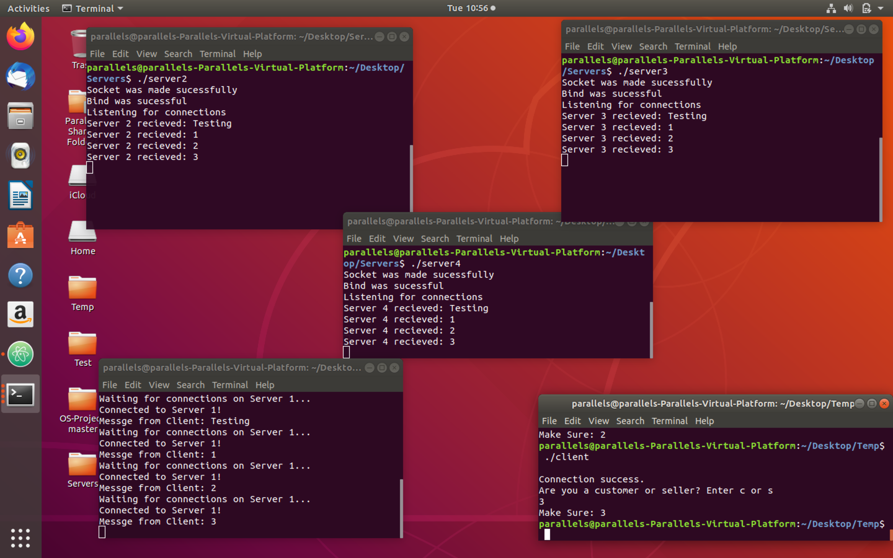

# OS-Auction


## Explanation

For testing purposes I choose to divide the servers into 4 different files so they could easily be executed in a command line. But I wrote them in such a way that they can be just copy and pasted into one file without having to be rewritten.

### Requirements

For this type of IPC it needs to be run in linux.. or maybe windows but I haven' test that.

Also to compile the servers you need to use specific commands

```
gcc server1.c -o server -pthread -lrt
```

### Screenshot


